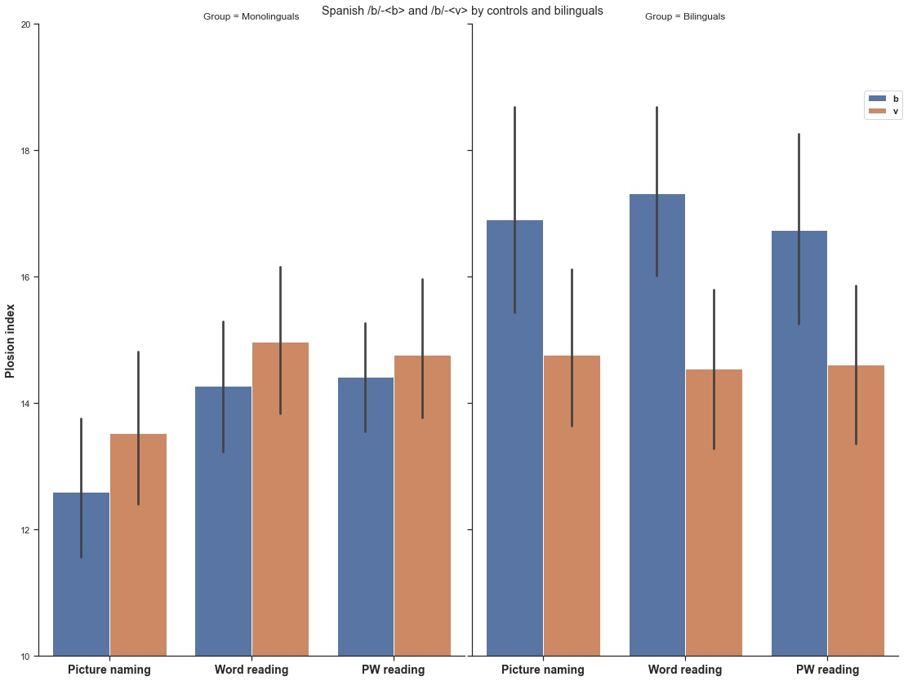
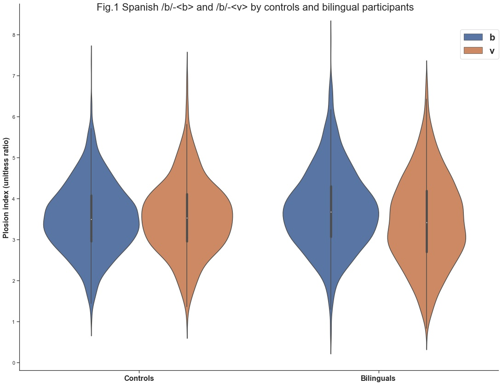

<br>

This is a Markdown document to present the results of the plosive (plosion index) part of the FrSpBil experiment.

In this document I am going to present the data obtained by extracting the plosion index (PI), which is a measure of the relative amplitude of the burst of a plosive, as compared to the closure phase immediately preceding it. The PI was obtained for a total of 9576 tokens from words containing the sound /b/ in initial position either in French or in Spanish. The words were produced by either French-Spanish bilinguals or monolingual controls in each language. 

144 tokens were lost either due to noise in the recording or because participants did not produce the required words. I did not remove any outliers because I believe that the experiment is partly based on creating the conditions for participants to produce unusual tokens, and I could not come up with a coherent justification for what an "anormal" token could mean with regards to the PI (as opposed to something like repsonse times for example, where a common sense explication for an anormally long token is a lapse in the participant's concentration)

<br>

```{r setup, include=FALSE}
knitr::opts_chunk$set(echo = TRUE)
Sys.setenv(LANG = "en") # Set error language to English
library(tidyverse)
library(ggplot2)
library(lme4)
library(emmeans)
library(rstatix) # Function rstatix::convert_as_factor
library(MASS) # Function MASS::fractions
library(sjPlot) # Function sjPlot::tab_model
```


```{r load_data, include=FALSE}
data = as.data.frame(read.csv("all_data_burst_24_01_2022.csv", sep=";"),header=T,sep=";",dec=".")

data$Plosion_index = as.numeric(data$Plosion_index)
data$VOT = as.numeric(data$VOT)
data$Length = as.numeric(data$Length)

str(data)
```


```{r Prepare_data, include=FALSE}

# Separate data by language
french <- data[data$Language=="French",]
spanish <- data[data$Language=="Spanish",]


# Make factors
french <- french %>% convert_as_factor(Speaker, Gender, Group, Task, Grapheme, Word)
french$Group <- relevel(french$Group, 'Monolinguals')
french$Grapheme <- relevel(french$Grapheme, 'b')

spanish <- spanish %>% convert_as_factor(Speaker, Gender, Group, Task, Grapheme, Word)
spanish$Group <- relevel(spanish$Group, 'Monolinguals')
spanish$Grapheme <- relevel(spanish$Grapheme, 'b')


str(french)
str(spanish)
```

```{r Contrasts, include=FALSE}

# Create contrasts
F_VS_M <- c(-1, 1)
Mono_VS_Bi <- c(-1, 1)
b_VS_v <- c(-1, 1)

contrasts(french$Gender) <- F_VS_M
contrasts(french$Group) <- Mono_VS_Bi
contrasts(french$Grapheme) <- b_VS_v

contrasts(spanish$Gender) <- F_VS_M
contrasts(spanish$Group) <- Mono_VS_Bi
contrasts(spanish$Grapheme) <- b_VS_v

# Custom contrast for task
Contrasts <- rbind(
  Naming_Vs_Reading = c(name=2, PW=-1, read=-1),
  Word_VS_PW = c(name=0, PW=1, read=-1)
) 

# fractions(t(Contrasts))

# Function to calculate general inverse
ginv2 <- function(x)
  fractions(provideDimnames(ginv(x),
                            base=dimnames(x)[2:1]))


contrast_mat <- ginv2(Contrasts)

# contrast_mat

```

# 1. French data


The data consists of 4864 tokens of the sounds /b/ - \<b> and /v/ - \<v> produced by the bilinguals and the French controls. With this data we were mostly interested in testing whether French-Spanish bilinguals produce a different /v/-<v> sound than French monolingual, due to the influence of the Spanish sound /b/ that can be written <v>.

I analyzed the data with a mixed-effects linear model. The dependent variable is the log of the PI (because the distribution is very right-skewed), with three fixed effects: Group (bilinguals vs controls), Grapheme (\<b> versus \<v>) and Task (herbert contrast between picture naming and the reading tasks first, then between word ans pseudoword reading), and all the interactions between these three effects. There was also a fixed effect of Gender, but no interactions between Gender and the other effects. I started with the the maximal model, and removed random effects until the model was able to converge, trying to follow the guidelines in Barr, Levy, Scheepers and Tily (2013) and Bates, Kliegl, Vasishth and Baayen (2015). (I am not showing the random effect variance in the results table, let me know if you'd like to see it)

<br>

```{r French_model}

# The full model fails to converge
# PI_f_no_convergence <-lmer(log(Plosion_index) ~ Group*Grapheme*Task + Gender + (Grapheme*Task|Speaker) + (1 + Group|Word), data = french, contrasts = list(Task = contrast_mat), control=lmerControl(optCtrl=list(maxfun=50000), optimizer="bobyqa"))

# After removing some of the random slopes, a much reduced model ends up converging
PI_f <-lmer(log(Plosion_index) ~ Group*Grapheme*Task + Gender + (1 + Grapheme + Task|Speaker) + (1|Word), data = french,
            contrasts = list(Task=contrast_mat), control=lmerControl(optCtrl=list(maxfun=50000), optimizer="bobyqa"))

# summary(PI_f) 
tab_model(PI_f, show.se = TRUE, show.stat = TRUE, show.ci = NULL, show.re.var = FALSE)
```

<br>

If there was a difference between the way bilinguals and controls produce /v/, we would have expected to see a Group*Grapheme interaction, possibly modulated by Task. None of that is present in the data, only an obvious main effect of Grapheme, because in this French data the two graphemes \<b> and \<v> represent two different sounds /b/ and /v/, and a main effect of Gender, with men producing slightly more explosive sounds.

Still, the Group * Grapheme interaction has a p-value of .1, so we might as well take a look at a graph to see if anything interesting is happening. But /v/ appears to be produced exactly the same way by bilinguals and controls, if anything it is /b/ that is slightly different, being produced with a higher PI for the monolinguals than the controls, and with a higher PI from picture naming to word reading to pseudoword reading. But none of those effects are significant and even if they were true effects there would not be an easy explanation.

<br>


<br>

# 2. Spanish data


I fit a similar model to the Spanish data, once again starting from a maximal model and removing random effects, but this time the model converged without removing the random slope for the effect of Group across words, so I kept it in the model. There were 4712 tokens in the Spanish data. 

<br>

```{r Spanish_model}

PI_s <-lmer(log(Plosion_index) ~ Group*Grapheme*Task + Gender + (1 + Grapheme + Task|Speaker) + (1 + Group|Word), data = spanish,
contrasts = list(Task=contrast_mat), control=lmerControl(optCtrl=list(maxfun=50000), optimizer="bobyqa"))
  
# summary(PI_s)

tab_model(PI_s, show.se = TRUE, show.stat = TRUE, show.ci = NULL, show.re.var = FALSE)

```

<br>

The model yields a very nice Group*Grapheme interaction, with /b/-\<b> produced with a much higher PI than /b/-\<v>, but only for the bilingual group. Here again there was a main effect of Gender, with men generally producing more explosive sounds than women. None of the other effects were significant, in particular there were no effects of Task whatsoever, which is an indication that orthography effects do not appear to be transient, and rather to have an influence on long-term representations.

<br>



<br>

Ther are two possibilities for this orthographic effect for the bilinguals: (1) they sometimes insert French /v/ in the /b/-\<v> condition, producing a normal Spanish /b/ the rest of the time, and (2) they have a "hybrid" category for /b/-\<v>, producing a sound that is neither /b/ not /v/. A look at the distribution does not seem to indicate a bimodal distribution.

<br>



<br>

Nonetheless I tried to look into whether there were more tokens produced without a burst for the bilinguals in the /b/-\<v> condiition, by marking each individual token as containing a plosive burst or not. The result are shown in the following table:

<br>

```{r burst table}
xtabs( ~ Group + Grapheme + Burst, data=data)
```

<br>

I fit a very simple logistic regression model to this data, to see if there was a bigger difference between the /b/-\<b> and the /b/-\<v> conditions for the bilinguals than for the controls in the number of non-plosive tokens produced. The model confirmed that it was the case.

<br>

```{r burst model}

logistic <- glm(Burst ~ Group*Grapheme, data=spanish, family="binomial")

# summary(logistic)

tab_model(logistic)

```

<br>

These results would seem to argue in favor of explanation (1) for the effect of orthography in the bilingual group, but the difference between the bilinguals and the controls does not disappear even after excluding all the non-burst tokens from the data, as shown in the following model:

<br>

```{r Spanish_plo_model}

# Now using only the burst tokens

spanish_plo <- spanish[spanish$Burst == 1,]

PI_s_plo <-lmer(log(Plosion_index) ~ Group*Grapheme*Task + Gender + (1 + Grapheme + Task|Speaker) + (1 + Group|Word), data = spanish_plo,
contrasts = list(Task=contrast_mat), control=lmerControl(optCtrl=list(maxfun=50000), optimizer="bobyqa"))
  
# summary(PI_s_plo)

tab_model(PI_s_plo, show.se = TRUE, show.stat = TRUE, show.ci = NULL, show.re.var = FALSE)
```

<br>

Similarly, after removing the non-burst tokens, the distributions do not appear markedly different. The difference between the /b/-\<v> condition for the bilingual group and all the other conditions mostly lies in a much flatter distribution with tokens over the whole range of the distribution. To me, this would argue in favor of both explanations (1) and (2) being true, with bilingual participants somehow "oscillating" between /b/ and /v/ in the /b/-\<v> condition.

<br>


